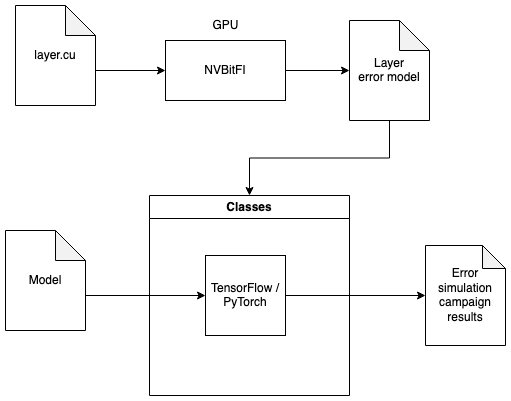
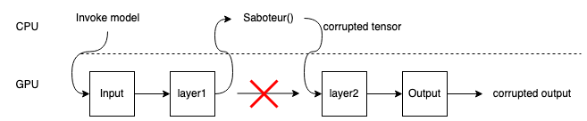

# Classes
CLASSES (Cross-Layer AnalysiS framework for Soft-Errors effectS in CNNs), a novel cross-layer framework for an early, accurate and fast reliability analysis of CNNs accelerated onto GPUs when affected by SEUs.
A theoretical description of the implemented framework can be found in:
C. Bolchini, L. Cassano, A. Miele and A. Toschi, "Fast and Accurate Error Simulation for CNNs Against Soft Errors," in IEEE Transactions on Computers, 2022, doi: 10.1109/TC.2022.3184274. <br>

If you use Classes in your research, we would appreciate a citation to:

>@ARTICLE{bc+2022ea,<br>
>  author={Bolchini, Cristiana and Cassano, Luca and Miele, Antonio and Toschi, Alessandro},<br>
>  journal={IEEE Transactions on Computers}, <br>
>  title={{Fast and Accurate Error Simulation for CNNs Against Soft Errors}}, <br>
>  year={2022},<br>
>  volume={},<br>
>  number={},<br>
>  pages={1-14},<br>
>  doi={10.1109/TC.2022.3184274}<br>
>}

## Table of Contents

1. [Copyright & License](#copyright--license)
2. [Dependencies](#dependencies)
3. [Installation](#installation)
4. [Usage](#usage)
    1. [TensorFlow2 - As a K function](#as-a-k-function)
    2. [TensorFlow2 - As a layer](#as-a-layer)

## Copyright & License

Copyright (C) 2024 Politecnico di Milano.

This framework is free software: you can redistribute it and/or modify it under the terms of the GNU General Public License as published by the Free Software Foundation, either version 3 of the License, or (at your option) any later version.

This framework is distributed in the hope that it will be useful, but WITHOUT ANY WARRANTY; without even the implied warranty of MERCHANTABILITY or FITNESS FOR A PARTICULAR PURPOSE. See the [GNU General Public License](https://www.gnu.org/licenses/) for more details.

Neither the name of Politecnico di Milano nor the names of its contributors may be used to endorse or promote products derived from this software without specific prior written permission.

## Dependencies 
You need Tensorflow 2 and Numpy to use this library.

## Installation 

To install the framework you only need to clone the repository 
```
git clone https://github.com/D4De/CLASSES.git
```
and import the `src` folder.

## How it works
To fully understand how Classes works we strongly suggest to read our paper _Fast and Accurate Error Simulation for CNNs Against Soft Errors_, that explains the philosophy of the CLASSES framework.
Nonetheless, we want to provide a small description of its operation. 
The following image provides a high level representation of the whole framework, we executed an error injection campaign
at GPU level using NVBitFI for each of the [supported layers](#operators-supported) in order to create a database of error models.
<br>

<br>
These models are then used by Classes in conjunction with either TensorFlow or PyTorch to simulate the presence of an error
during the execution of a given model.

Here we can see more in depth how Classes works.
<br>

<br>
It uses the concept of a saboteur, either developed [as a layer](#as-a-layer) or [as a backend function](#as-a-k-function).
The idea is to interrupt the execution of the model after the target layer has been executed, corrupt the output obtained
up until that point and then resume the execution. For this reason the error models adopted represent the effect of an error at the
output of each layer.

Due to how TensorFlow2 works a layer could contain both an operator and an activation function, to target each part the 
user of Classes must execute two distinct campaign selecting different [OperatorType](src/operators.py) accordingly to
the components of the target layer.


## Usage
The framework is composed by two distinct modules, the injection sites generator and the error simulator. The first one, as the name suggests, is responsible for the creaton of the injection sites and it is common among all the different implementations of the error simulator. The error simulator itself has been implemented in four different ways in order to work with both TensorFlow (1 and 2) and PyTorch. Note that the PyTorch version and the Tensorflow 1 version are both deprecated. For PyTorch you can use the new D4De/classes-pytorch repository. A more precise description of the usage of the framework with examples can be found can be found in the `example` folder. 

### Injection sites generator 

This module is used to create the injection sites needed for the error simulation campaign. The whole module is accessed through the function 
`generate_injection_sites(sites_count, layer_type, layer_name, size, models_mode='')`
its inputs are:
- sites_count: the number of injection sites to create
- layer_type: what kind of layer we are injecting
- layer_name: a string representing the layer name, can be empty
- size: a string that defines the output shape of the layer we want to target. It must be defined with the following format '(None, Channel, Height, Width)' 

This function returns three lists: 
- injection_sites: list of injection sites, each injection site has an index and a value, the value itself has two parameters, value_type that describes what kind of value has been selected based on our error models and raw_value which is the numerical value. 
- cardinalities: list of cardinalities selected.
- patterns: list of patterns selected.

### Supported operators
The operators supported for the error simulation are the ones described in the enum [`OperatorType`](src/operators.py). Currently, we support the following layers (they are the ones used in Yolo, that is the case study considered in the paper):
- Convolution: 2d GEMM convolution 
- Pooling: Max and Average 2d
- Activations: Relu, Clipped Relu, Sigmoid, Tanh, Elu
- Bias Add

### Error models
We executed an error injection campaign on GPU to create error models that could be as loyal as possible to the real world. The older error models used in classes were defined based on three parameters
- Cardinality: the number of corrupted values observed in a faulty tensor with respect to the expected version.
- Pattern: the spatial distribution of the corrupted values.
- Values: the numerical value of the corrupted data.

These models were revised and rationalized in the thesis  and used in the following publications where CLASSES was employed. Now the models are build hierarchically, modeling the errors first by their spatial patterns, that are classes of corrupted tensors that have similar spatial distribution patterns. Example of spatial patterns are extracted from experiments performed on an Ampere GPU using NVBITFI we found these recurring patterns:
1. **Single Point**: a single erroneous value is found in the output tensor.

2. **Same Row**: all the erroneous values are located on the same row of a single channel. It is also possible to have non-corrupted values between two erroneous ones.

3. **Bullet Wake**: similar to *Same Row* model, but the erroneous values are located along the channel axis. It is also possible to have channels without erroneous values on the axis.

4. **Skip X**: erroneous values are located with a stride equal to *X* positions in the linearized tensor.

5. **Single Block**: there is a single corrupted channel, where all the erroneous values are adjacent and the cardinality is comprised between 10 and 64.

6. **Single Channel Alternated Blocks**: multiple nonadjacent blocks of at least 16 consecutive erroneous values located in the same channel.

7. **Full Channel**: more than 70% of the values of the same channel are erroneous.

8. **Multichannel Block**: an extension of the *Single Block* model where multiple channels are corrupted, each with a single block pattern.

9. **Shattered Channel**: a combination of the *Bullet Wake* and *Single Map Random* models where erroneous values are located on a line along the channel axis and at least one channel is randomly corrupted.

10. **Random**: either a single channel or multiple ones are corrupted with an irregular pattern.
    
For each occourring pattern the error models contains other two sub characterizations:
* Spatial parameters, that allow to better generalize and characterized the spatial distributions. Examples of spatial parameters are:
    - Percentage of channels of the tensors that are corrupted
    - Maxium number of faults that are corrupted
    - Interval (or skip) between two corrupted values in the linearized tensor.
    Each spatial class has its own set of parameters.
* Domain models, that models how the values are changed by the faults. To derive the domains models each corrupted value is first put in one of four Value Classes:
    - In Range: The corrupted value remains inside the operating range of the golden tensor (i.e. ``[min(golden_tensor), max(golden_tensor)]``), but it is not exactly zero.
    - Out of Range: The corrupted value falls of the operating range of the golden tensor.
    - NaN: The value is NaN, or infinity
    - Zero: The value is exactly zero.
Then the tensor is classified in a Domain class that can be:
    - Single Value Class: All errors belong to the same value class
    - Double Value Class: All errors belong to only two different value classes. In this case the proportion of values is stored in the class.
    - Random. The tensor is not on one of these two classes.

These error models are saved in the ```models``` folder, with one different json file per operator. CLASSES will read from these models and will generate error patters using the models specified in the json. 
For a given operator the json file contains the relative frequency of each spatial pattern, and for each spatial pattern, there are the relative frequency for each configuration of spatial parameters and domain parameters. The injection site generator will pick at random a spatial pattern (with a probability equal to its relative frequency) and a configuration of spatial and domain parameters. The generator then picks the corrupted locations in the tensor by calling the pattern generator function corresponding to the picked spatial pattern (the code pattern generator functions are in ```src/pattern_generators```). For each corrupted location a value is picked based on the domain parameters distribution, and then the corrupted tensor is inserted in the network by the error simulator module described below.

### Error Simulator

The module used to perform the error simulation campaign in TensorFlow 2 has been developed in two different variants:

#### As a K function

Using Keras backend functions allows us to split a model into two separate submodels, one that performs the computation from the input layer to the one we selected for the injection and one that produces the final result from the output of the selected layer. With this approach we can obtain the selected layer's output and modify it before feeding it to the second submodel.
If the model is not linear (e.g. a unet) this approach requires us to make sure that each skip connection is correctly set for the final output to be correctly produced. In the `example/tensorflow2/k_function` folder we provide two examples showing how to use this version of the error simulator on a linear model and on a model with skip connections.

#### As a layer

We also developed the injector as a layer that can be placed into the module like any other keras layer. This approach simplifies the process in case of models with skip connections since we do not need to manually restore them but it has some drawbacks. The most important one is that due to how TensorFlow2 works we are not able to generate injection sites each time we perform a prediction, instead we need to create them at setup time and pass them as inputs to the layer. The injector will randomly select one at each prediction.


## Examples

Examples can be found in ``examples/tensorflow2`` directory.

For example you can run one by doing:
```
cd examples/tensorflow2/as_a_layer

python linear.py
```


