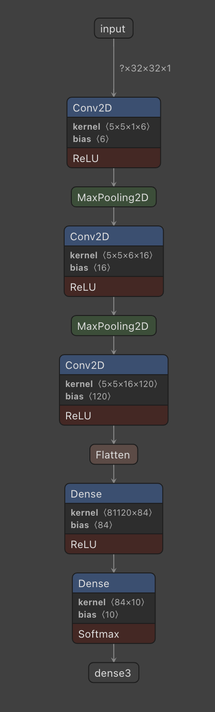
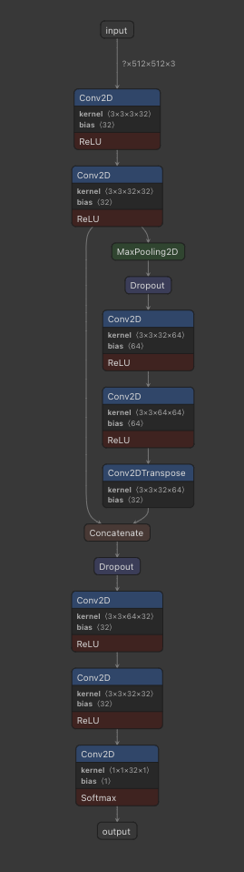

# TensorFlow2 simulator as a keras backend function
Here we use Keras backend functions to split the execution of the model into two submodels. 
While this approach is trivial in case of linear models particular attention must be given to models with skip connections. 
We will show two different examples
## How to use it
### Linear model
The first example shows how to perform error simulation on a linear model.
If we have a model with no skip connections <br>  <br>

the process is straightforward and the steps needed are the following
1. Define what layer to target and find its index in the list `model.layers`
2. Use the function `inject_layer` to execute the error simulation. The parameters it takes are the following
    - model: the model we are using
    - img: the image over which we will perform inference
    - selected_layer_idx: index of the target layer 
    - layer_type: an element of the enum [OperatorType](../../../src/operators.py) defining what kind of layer we are targeting
    - layer_output_shape_cf: a string of format '(None, Channels, Width, Height)' defining the output shape of the target layer
    - models_folder: a string that identifies the folder where we placed the error models.
 
For example if we want to target the second convolutional layer whose index is 3 we will do the following
```python
selected_layer_idx = 3
for _ in range(NUM_SIMULATION):
    res = inject_layer(model, image, selected_layer_idx, OperatorType['Conv2D'], '(None, Channels, Width, Height)', '/models')
```

### U-Net
Dealing with models with skip connections is more complex and requires carefully building the correct connections.
As an example we show a small U-Net model <br>  <br>
Here we need to be careful with the convolutional layers inside the skip connection because we need the output of 
the second convolutional layer in order to properly produce the final output. <br>
The steps needed in this situation are the following:
1. Execute the model from the input layer through the targeted convolutional layer
2. Modify the output of the convolutional layer based on the selected injection sites
3. Execute the model from the convolutional layer through the concatenate layer
4. Calculate the second input of the concatenate layer
5. Execute the model from the concatenate layer through the output layer

The functions needed are the following
```python
get_selected_layer_output = K.function([model.layers[0].input], [model.layers[selected_layer_idx].output])
get_conv2_output = K.function([model.layers[0].input], [model.layers[conv2_idx].output])
get_input_concatenate = K.function([model.layers[selected_layer_idx + 1].input], [model.layers[conv2d_transpose_idx].output])
get_final_output = K.function([model.layers[concatenate_idx].input], [model.layers[-1].output])
```
They respectively produce the following results

1. `get_selected_layer_output`: output of the selected layer
2. `get_conv2_output`: output of the second convolutional layer, the first input of the concatenate layer
3. `get_input_concatenate`: output of the conv2d_transpose layer, second input of the concatenate layer
4. `get_final_output`:  final output of the model starting from the concatenate layer

## Examples
`linear.py` and `small_unet.py` are documented examples showing the whole code needed for the two described situations.